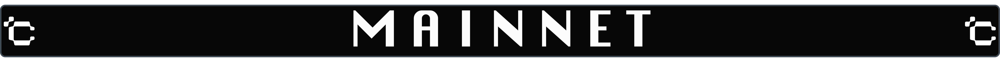

### :bust_in_silhouette: About us:
**We are Crouton Digital, international team located in Latvia.
Full time crypto since 2019. Running validator nodes Pos/Pow. Monitoring 24/7 secure and reliable.
**
#
### :computer: Hardware:
:earth_africa: **Location - [Hetzner DS](https://www.hetzner.com/dedicated-rootserver/ax101), [Google Cloud](https://www.ovhcloud.com/de/bare-metal/), [Worldstream](https://www.digitalocean.com/)  
:black_small_square: Processor - AMD Ryzen 5950X (32 CPU, 128 RAM)  
:black_small_square: Memory - 6.8 TB NVMe  
:black_small_square: Bandwidth - 1 Gbit/s-Port**

#

# 

#

